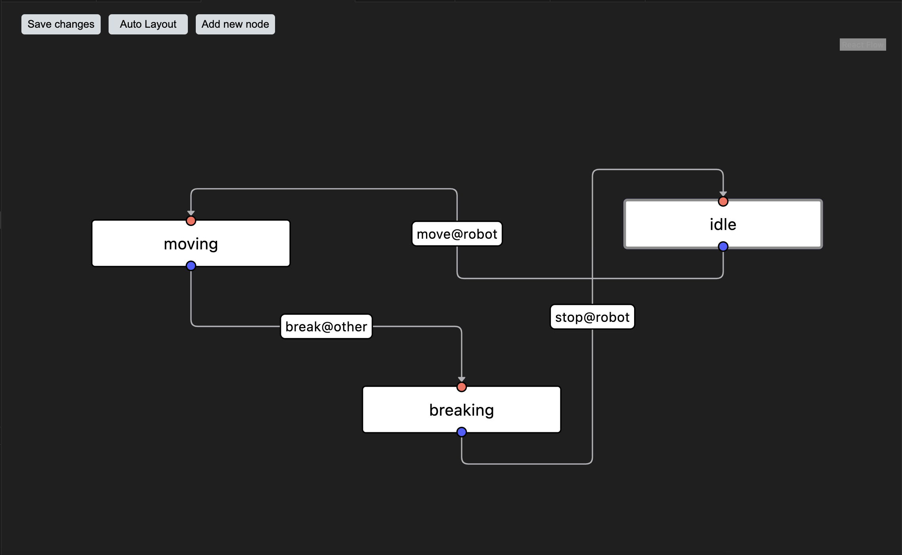
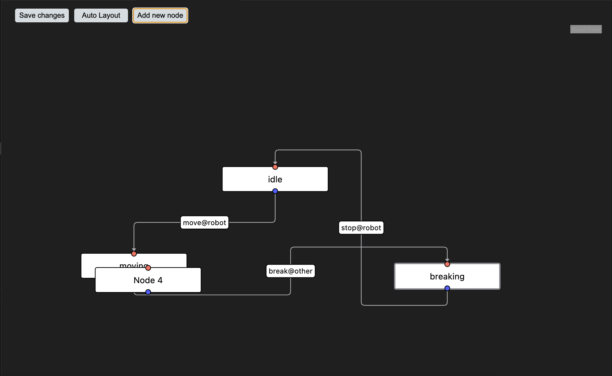
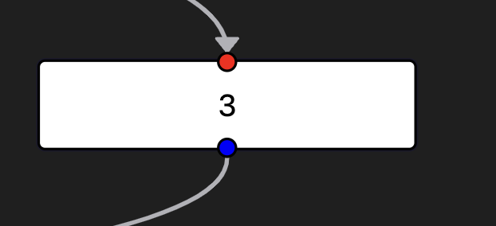
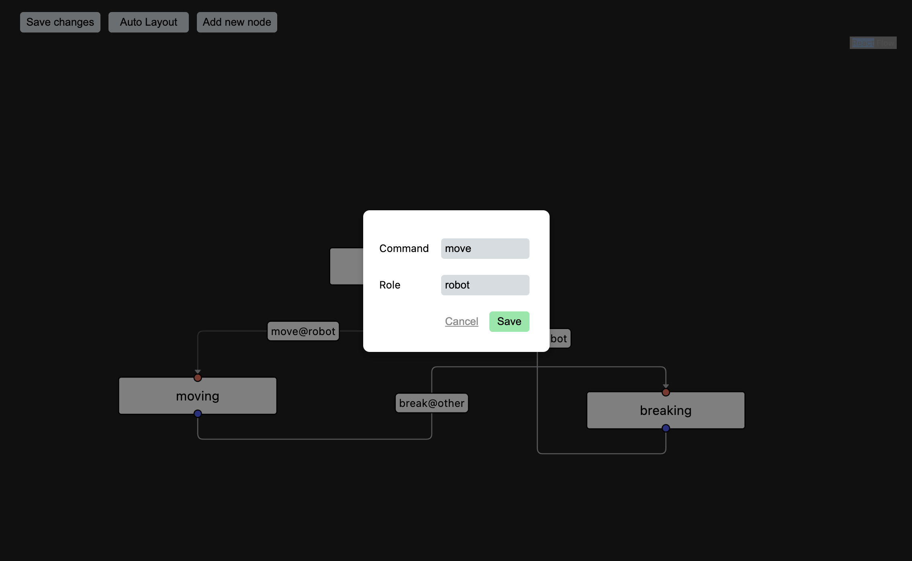
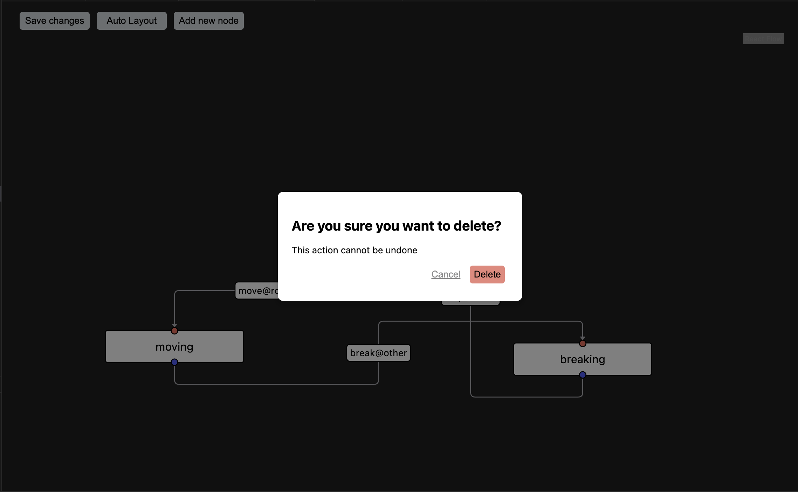

# Visual Swarm Protocol Editing

This Visual Studio Code extension is used as a way to visualise and edit elements of type SwarmProtocolType from the [@actyx/machine-runner](https://github.com/Actyx/machines/tree/master/machine-runner) library. This library is part of the set of libraries from Actyx called [machines](https://github.com/Actyx/machines).

The extension allows the user to visualise a protocol by using the VS Code command palette, and using the command `Visualise protocol`. The extension can also be opened using the keybinding Ctrl + Shift + E (Cmd + Shift + E for mac). The extension will show the flow described in the file, and from here it is possible to make and save changes. Below is an example how a protocol can look in the extension.



## Features

### Creating new states

Once the flow has been visualised, it is possible to create a new state by pressing the button "Add state" in the top left corner. This will result in a new state appearing near the current flow. It might be necessary to zoom out a bit to see the new state.



### Creating new transitions

New edges are created by dragging from the input handle of a state to the output handle of a node. Input nodes are denoted by the colour red, and can only have transitions going into the state. Output handles are denoted by the blue colour, and these can only create outgoing transitions.



> It is possible to drag edges from a red to a blue handle, it will however create a transition in the opposite direction.

### Renaming states and transitions

By double-clicking either a state or an transition it is possible to rename the label of the element. For states, only a name is required.


For transitions, a command and role is required, in order to follow the syntax of the machine-check library.



### Deleting states and transitions

By selecting a state or transition and then pressing the backspace button on the keyboard, the element can be deleted. The user will be prompted with a dialog asking if they are sure.



### Autolayout

Pressing the autolayout button moves the states and transitions according to an algorithm. Pressing this button will also ensure that no nodes overlap.

### Saving changes

Changes can be saved either by pressing the "Save changes" button or by pressing Ctrl + S on the keyboard (Cmd + S on mac). The changes will then be reflected in the protocol, but the changes to the file are not saved automatically, this is up to the user. There is no formatting on the new protocol, this is to allow any auto-formatters the user may have installed to format on save.

## Requirements

For the visualisation of a protocol to work, it is important that a variable is initialised with the type `SwarmProtocolType`. See the example below.

```typescript
const protocol: SwarmProtocolType = {
  initial: "idle",
  transitions: [
    {
      source: "idle",
      target: "moving",
      label: { cmd: "move", role: "robot" },
    },
    {
      source: "moving",
      target: "breaking",
      label: { cmd: "break", role: "other" },
    },
    {
      source: "breaking",
      target: "idle",
      label: { cmd: "stop", role: "robot" },
    },
  ],
};
```

## Known Issues

- It is possible to drag a transition going from output to input, but it will create a transition in the opposite direction.
- Transitions and labels may overlap with nodes. The problem can be solve by dragging nodes away from each other.
- It is not possible to move edges.

## Release Notes

This version is only meant for testing.

### 0.1.0

Initial realease of extension for testing purposes.
